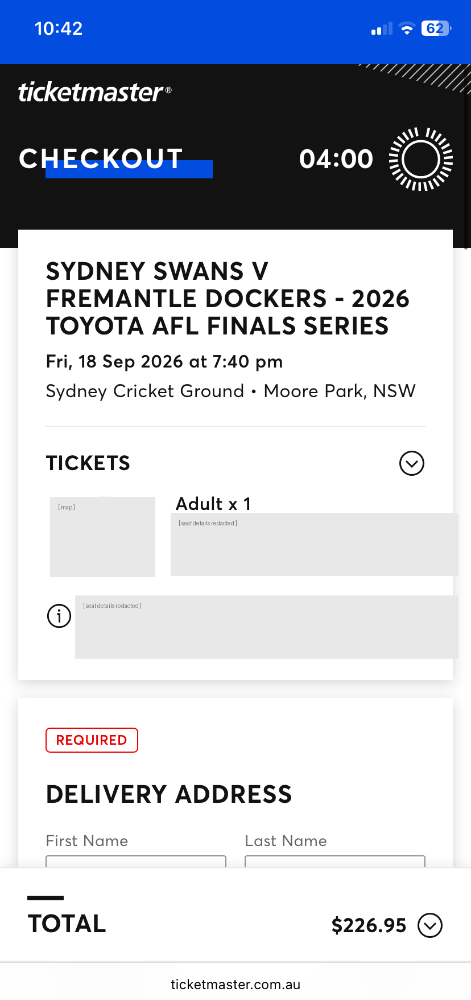

# ticket-drop-watcher

[](https://claude.com/claude-code)
[](docs/CLAUDE_WORKFLOW.md)
[](docs/PITFALLS.md)
[](LICENSE)
[](https://seatwatch.archie-huybers.workers.dev)

**How to enable your Claude Code to catch silently-released seats on sold-out Ticketmaster events, and notify you to go buy the ticket**

> **Artifacts created by [Claude Code](https://claude.com/claude-code) with Huyber's supervision**,
>
> The monitor is the artefact. The **method** is the reusable part, and it is
> written up in full: **[docs/CLAUDE_WORKFLOW.md](docs/CLAUDE_WORKFLOW.md)**

Ticketmaster's sold-out events that don't have a re-sale avenue do not remain sold out for good. Seats come back constantly - Tickets refunded, held
allocations released, abandoned carts timing out, payments failing. They reappear in the **normal buy flow**, with no announcement, no waitlist, and
no "notify me". If you are not looking at the page in that exact three-minute window, you never knew it happened.

This repo makes Claude watch for you.

### Don't want to run it yourself? [Seat watch](https://seatwatch.archie-huybers.workers.dev) is the hosted version

**[seatwatch.archie-huybers.workers.dev](https://seatwatch.archie-huybers.workers.dev)** —
the demo account needs no password.

Same watching, none of the setup: monitors with full history, every window and every poll
recorded, email and phone alerts, and accounts so more than one person can watch more than
one event. Built on 17 September 2026 at the **Claude Fable 5.1 Build Day/Night in Sydney,
hosted at MongoDB**, one of [Claude Community's global Build Days](https://claude.com/community).
This repo is what I brought to it. The site is what came out.

**This repo remains the self-hosted option, and it is not a lesser one.** It has no
database, no accounts and no dependency on that site: it emails you directly and always
has. If you would rather own the whole thing, everything you need is below. If you would
rather not, use the site. Starting this watcher with `--monitor` and `--token` makes it
report to the site as well; leave those off and nothing here changes.

The site also adds two more ways to run the same watch, for people without a terminal:

| Runner | Where it runs | Watches Ticketmaster |
|---|---|---|
| **This repo** | Your terminal, driving a real Chromium | Yes, with the fullest seat detail |
| Chrome extension | Inside a Ticketmaster tab you already have open | Yes, no terminal needed |
| Browser tab | A Web Worker in the site itself | **No.** See below |

That last row is the constraint this repo exists because of. A web page cannot read
Ticketmaster: it sends no `Access-Control-Allow-Origin` header, so the browser refuses to
hand the response body to any page that is not Ticketmaster's own, whatever address the
request came from. A server cannot either, because datacenter addresses get `403`. The
read only works from inside a real `ticketmaster.com.au` page, which is exactly what
Playwright buys you here.

---|---|---|
| This repo | A terminal, driving a real Chromium | Yes, with the fullest seat detail |
| [Chrome extension](https://github.com/C-H-U-Y/seatwatch/tree/main/extension) | Inside a Ticketmaster tab you already have open | Yes, no terminal needed |
| Browser tab | A Web Worker in the dashboard itself | **No.** See below |

That last row is the interesting constraint, and it is why this repo exists at all: a web
page cannot read Ticketmaster. Ticketmaster sends no `Access-Control-Allow-Origin` header,
so the browser refuses to hand the response body to any page that is not Ticketmaster's
own, whatever address the request came from. A server cannot do it either, because
datacenter addresses get `403`. The only place the read works is inside a real
`ticketmaster.com.au` page, which is what Playwright buys you here and what the
extension's content script buys you there.

---

## The event this was built for

**Sydney Swans v Fremantle Dockers — AFL Preliminary Final, SCG, Fri 18 Sep 2026.**
General sale sold out on Monday 14 Sep at 3:00pm.

### What that looks like in practice

One morning, from the monitor's own logs:

```
WINDOW OPEN  [10:38:09]   closed [10:42:23]    3 alert cycles
WINDOW OPEN  [10:45:43]   closed [10:53:07]    4 alert cycles
WINDOW OPEN  [10:58:44]   closed [11:03:59]    5 alert cycles
WINDOW OPEN  [11:11:41]   closed [11:20:09]    5 alert cycles
WINDOW OPEN  [11:25:36]   closed [11:31:03]    4 alert cycles
WINDOW OPEN  [11:36:31]   closed [11:41:47]    4 alert cycles
WINDOW OPEN  [11:49:27]   closed [11:54:42]    3 alert cycles
WINDOW OPEN  [12:00:06]   closed [12:08:45]    3 alert cycles
```

Eight windows in ninety minutes. Each open for **three to eight minutes**,
recurring every ten to thirteen. Each invisible to anyone not staring at the page.

That distribution is also the entire argument for the polling interval. At a
three-minute poll you would coin-flip most of these. At sixty seconds you catch
all of them.

## Proof it works

<p align="center">
  
</p>

Checkout at 10:42, two days after the event sold out. One seat, bought by hand,
off an alert from this monitor — during the `[10:38:09] → [10:42:23]` window in
the table above.

*(Seat identifiers redacted.)* 

---

## How it works

Ticketmaster has no public availability API, and blocks plain HTTP clients —
`curl` from a server gets `{"response":"block"}`, datacenter IPs get a TLS reset.
But the event page's *own* XHR works fine.

So the monitor drives a real browser and calls the API from inside the page,
reusing its cookies and bot clearance:

```
Playwright (headful Chromium, persistent profile)
   └── page.evaluate(fetch)  ->  /api/quickpicks/<eventId>/list
                                   └── picks[] non-empty  ->  ALERT
```

`picks.length > 0` is the entire detection signal. Three independent searches per
cycle (quantity 1, 2 and 3), about three requests a minute.

On a hit it beeps, raises a desktop toast, opens the event page as a **tab in the
browser you already have open**, and emails you. Then a human buys the ticket.

---

## Quick start

**Requirements:** Node 18+, and a desktop session — this cannot run on a headless
server (see [Things that are not optional](#things-that-are-not-optional)).

```bash
git clone https://github.com/C-H-U-Y/ticket-drop-watcher
cd ticket-drop-watcher
npm install
npx playwright install chromium
```

Find your event id — the hex string in the event page URL:

```
https://www.ticketmaster.com.au/event/1A00612F1B0C4B5E
                                      ^^^^^^^^^^^^^^^^
```

Verify your alerts actually fire **before** trusting it:

```bash
EVENT_ID=1A00612F1B0C4B5E npm run test-alerts
```

You should get a desktop toast and, if configured, an email showing the real
alert format. Do not skip this — a monitor whose alerts do not reach you is
indistinguishable from an event with no tickets.

Then run it:

```bash
EVENT_ID=1A00612F1B0C4B5E npm run watch
```

A Chromium window opens and stays open. That is not a bug — see below.

> **Read [docs/PITFALLS.md](docs/PITFALLS.md) before you rely on this
> unattended.** Every failure in it shares one shape: the monitor looks fine and
> is not actually watching. That is indistinguishable from "no tickets yet" until
> you go and check.

> **Prefer to have Claude set this up for you?**
> [docs/SETUP_WITH_CLAUDE.md](docs/SETUP_WITH_CLAUDE.md) has a copy-paste prompt
> that does the whole install, wires up email, and verifies each failure mode
> against real output rather than assuming. Clone the repo, run `claude` inside
> it, paste the prompt.

### Non-Australian events

Set `EVENT_BASE_URL`, e.g. `https://www.ticketmaster.com/event/`. The
`/api/quickpicks/` endpoint is the same shape across Ticketmaster regions, but
only the AU site has been tested.

## Run it from the Seat watch dashboard

The env vars above are one way to configure a run. The other is to create the
monitor at <https://seatwatch.archie-huybers.workers.dev/dashboard>, which holds
the event, quantities, poll interval and ntfy topic for you, and copy the
command it shows:

```bash
node src/tm-watch.js --monitor <id> --token <token> --api https://seatwatch.archie-huybers.workers.dev
```

The runner fetches its config from the dashboard, then reports every poll
cycle back. The dashboard reads Live within one poll, Silent five minutes after
the last pulse (laptop asleep, browser dead), and records each window of
availability and each alert. Deactivating the monitor on the dashboard makes
the runner close its browser and idle within one poll; reactivating brings it
back within five minutes. Changing the poll interval on the dashboard takes
effect the next time the runner is reactivated.

Nothing about where the polling happens changes: it is still your own machine,
your own connection, and a visible Chromium window that stays open. The
dashboard only stores what the runner reports and sends the phone push.

### The dashboard is a separate project

Seat watch is one implementation of the three-verb protocol in `src/control.js`
(`hello`, `start`, `pulse`, plus `bye`), not a dependency of this runner. This
repo works entirely on its own with env vars, and `control.js` is only loaded
when `--monitor` and `--token` are passed.

Source: <https://github.com/C-H-U-Y/seatwatch>. It also ships two other runners
against the same endpoint, which are worth knowing about because they bound
what is possible:

- **A Web Worker in a browser tab.** Real runner, real schedule, real database
  writes. It cannot poll Ticketmaster, and no page can: Ticketmaster sends no
  `Access-Control-Allow-Origin` header, so a browser refuses to hand the
  response body to any page that is not Ticketmaster's own, whatever address
  the request left from. It watches CORS-enabled endpoints instead.
- **A Chrome extension** whose content script runs inside a real
  ticketmaster.com.au tab, which is the same same-origin trick this runner gets
  from Playwright, without a terminal. Less seat detail, no install of Node.

This runner remains the one with the fullest reading, and the only one that
works with no browser tab open at all.

---

## Alerts

| Channel | Setup | Reaches you when |
|---|---|---|
| Desktop toast + beeps | none, works out of the box | you are at the machine |
| **Email (recommended)** | [docs/GMAIL_SETUP.md](docs/GMAIL_SETUP.md) | you are anywhere |
| Phone push (ntfy.sh) | set `NTFY_TOPIC`, free, no account | you have the app installed |

Desktop alerts are useless if you are not at the desk, which is most of the day.
**Set up email.** It is five minutes, and it is the difference between catching a
window and reading about it afterwards.

The app password is read from `~/.tm-watch-smtp`, never from a config file or an
environment variable, so it stays out of git, out of `pm2 env`, and out of any
terminal transcript.

An alert looks like this:

```
PRIMARY SEC12 row R seat 7 — 1 seat — from $66.00
  — cheapest of 4 ticket types (Junior 4-14 Years); other prices exist on this seat
```

Section, row, seat, count, price and ticket type — and, crucially, the price is
a **"from"**. The API is queried with `sort=price`, so a pick describes the
*cheapest* offer on that seat, not the only one. The seat above was reported at
$66 as a junior ticket and bought for $226.95 as an adult ticket. Same seat.

An earlier version printed a flat `$66.00 — Junior 4-14 Years`, which would have
talked you out of a seat that was perfectly buyable.

---

## Keeping it running

A monitor you have to remember to restart is not a monitor. Run it under
[pm2](https://pm2.keymetrics.io/):

```bash
cp ecosystem.config.example.js ecosystem.config.js   # then edit it
npm install -g pm2
pm2 start ecosystem.config.js
pm2 save
```

To change any setting afterwards:

```bash
pm2 delete tm-watch && pm2 start ecosystem.config.js && pm2 save
```

> **Do not use `pm2 restart --update-env`.** It does not re-read the config file
> — it refreshes the environment from your shell, silently ignoring your edits,
> and a following `pm2 save` bakes the *stale* environment into `dump.pm2`.
> Verify a change landed by the `Poll ~Ns` banner in the logs, never by the
> absence of an error.

### Watching it from a Claude session

Claude Code is genuinely useful for supervising a long-running monitor. Ask it
for a watcher that reports **transitions**, not states:

```text
Set up a persistent watcher on the tm-watch pm2 log. Report only TRANSITIONS:
seats opening, a window closing, going blind on 403s, the log going stale, and
the process dying. Match on the p= values, not on literal log text.

Name the watcher so its name is not mistaken for an alert — the name is
repeated on every notification. Word the events by severity: shout the one I
must act on, keep routine self-healing ones lowercase, and prefix real faults
with PROBLEM.
```

Every one of those constraints was learned by getting it wrong:

- A watcher keyed on the literal string `r=0` stopped detecting anything the
  moment a change made it print `r=skip`. It failed **silently**, which is the
  worst way for a watchdog to fail.
- Alerting only on *availability* makes a window **closing** invisible, so you
  never learn how long you actually had.
- The watcher was first named *"tm-watch state changes (seats open/close, blind,
  stale, process down)"*. That name is printed as a header above **every**
  notification, so the phrase "seats open" appeared hourly on routine 403s. It
  was read as an alert. A watcher's name is part of its output.
- Routine 403s and real availability were both reported in capitals, which made
  them look equally urgent when only one needed a human.

A Claude-side watcher dies with the session. The monitor does not — under pm2 the
beeps, toast, browser tab and email keep running whether or not anyone is
watching the terminal.

More prompts like this one, and the reasoning behind them, in
[docs/CLAUDE_WORKFLOW.md](docs/CLAUDE_WORKFLOW.md).

---

## Things that are not optional

Each of these was established by testing, and each looks like a tidy-up waiting
to happen. They are not.

**`HEADLESS` must be `false`.** A/B tested on the same machine and IP, eleven
minutes apart: headless got `err403` on every call *and* parsed `resaleEnabled`
as `null` — it was served a challenge page instead of the event page — and stayed
stuck for ten minutes. Headful returned clean results immediately. A visible
browser window is the price of this working at all.

**`QTYS` must stay `1,2,3`.** Ticketmaster sets `restrictSingleSeats`, so its
engine refuses to orphan a seat: a `qty=1` search returns **empty** even when a
pair is sitting right there. Three independent searches is not redundancy.

**Do not "simplify" it to an HTTP client.** Already tried. `curl`/`axios` get
`403 {"response":"block"}`; datacenter IPs get a TLS reset. The in-page `fetch`
is the point.

**Never lower the re-alert interval below `POLL_MS`.** An earlier version dropped
to a 30s poll the instant a seat appeared — quadrupling the request rate at
exactly the wrong moment. It tripped a sustained block, and because a 403 leaves
`picks` undefined, **live seats then look like no seats**.

---

## Tuning

`POLL_MS` defaults to 60s and `RELOAD_EVERY` to 30 polls. Keep the product at
roughly **30 minutes** — the page reload is what refreshes bot clearance, and
`RELOAD_EVERY` is counted in *polls*, not minutes. Change one, change the other.

**Raising `POLL_MS` does not reduce 403s.** They appeared at ~360, ~180, ~120 and
~60 requests/hour alike. It only makes you slower, and it stretches
`RELOAD_EVERY` so recovery takes longer too.

60s is a sensible floor. Below it you gain little and start looking impolite.

---

## Built with Claude — and how

This project was not "AI-assisted" in the sense of autocomplete. A human set the
objective and made every judgement call with real-world consequences; Claude Code
wrote all the code, ran the experiments, and kept the records.

What made that work was not the model. It was five rules:

1. **Never mark something done without stating the evidence** — a timestamped log
   line, a test result, a reconciled count. Not "should work".
2. **Record theories that turned out to be wrong**, so they are not rediscovered.
   Two are preserved in [Engineering notes](#engineering-notes) below.
3. **Memory files written at the moment of discovery**, pruned so every line
   earns its place in the next session's context.
4. **A tracker with an explicit "shelved" section** — decisions deliberately
   declined, marked *do not re-raise*.
5. **Watchers detect transitions, never literal log text**, because silence is
   not success.

Rule 1 is why the crash-recovery path was tested by *actually killing the
browser* rather than by reading the code and declaring it fixed.

**The full method, the reusable prompts, and the near-miss that nearly published
private data: [docs/CLAUDE_WORKFLOW.md](docs/CLAUDE_WORKFLOW.md).**

## Engineering notes

Most of the work here was not writing the poller. It was being wrong, in public,
and measuring until it stopped.

**"The 403s are a request-volume budget."** Wrong. They tripped at every rate
tested. Raising the interval made things *worse*, because `RELOAD_EVERY` counts
polls — so a slower poll also meant a later reload, and the reload was the fix.

**"Bot clearance expires after about an hour."** The episodes were suspiciously
regular — 20:24, 21:27, 22:33, 23:39, roughly 65 minutes apart. It looked like a
TTL. Then it ran clean from 23:45 to 02:50 and the theory died. The periodicity
was an artefact of busy-hour throttling, not a timer.

**The fix that actually worked** was mundane: a page reload clears a 403
immediately. Detecting an all-403 cycle and forcing a reload on the next poll
turned a 25–90 minute manual recovery into a 60-second automatic one.

**A silent, permanent death.** `check failed: ... browser has been closed`
repeated every poll forever. The recovery path called `page.goto()` on the
already-dead page, the throw was swallowed by a bare `catch {}`, the failure
counter reset, and it span blind — while the process manager still cheerfully
reported `online`. Nothing alerted, because nothing was *failing*. It now
relaunches the browser on first sighting; verified by killing Chromium outright
and watching it recover in fourteen seconds.

**Never assert more than you know.** This was the recurring bug class, and it
produced the best example in the project.

A pick came back as `"name": "Junior 4-14 Years"`, `"originalPrice": 66`. The
alert duly announced a $66 junior ticket — useless to an adult buyer, and easy to
dismiss. The seat was then bought as an **adult ticket for $226.95**. Same
section, same row, same seat.

The tell was in our own query string. It asks for `sort=price`, and the pick
carried **four `offerIds`** — four price types on one seat. The feed had answered
the question we asked ("cheapest offer") and the alert reported it as the answer
to a question we hadn't ("what is this ticket"). Nothing was broken; the code was
just claiming more than its data supported.

The same class, twice more: alerts announced "2 seats" for a single seat, because
the line printed the quantity that had been *searched for* rather than what came
back; and the price rendered as `$?` for days because the code guessed three
field names and all three were absent.

The fix each time was the same — report what the feed actually said, mark it
"from" or "unconfirmed" where the data is partial, and never restate an
assumption as a fact.

`src/test_alert.js` covers this: 30 assertions, including the real captured
payload that finally revealed the schema.

---

## Scope and conduct

This monitors availability and alerts a human. That is all it does.

- **It never buys, carts, or touches checkout.** Not an oversight — a decision.
  It is mechanically useless before inventory exists, it risks a block that would
  kill the manual path too, vendors void orders they believe were automated, and
  ticket-bot legislation sits on top of all of that.
- **It polls politely** — about three requests a minute, one event, one user.
- **It stores no credentials.** Your Ticketmaster session lives in a local
  browser profile; the email password lives in a file outside the repo.

Provided as-is for personal and educational use. Check your local law and the
vendor's terms before running it, and be sensible with the request rate.

## License

MIT — see [LICENSE](LICENSE).
